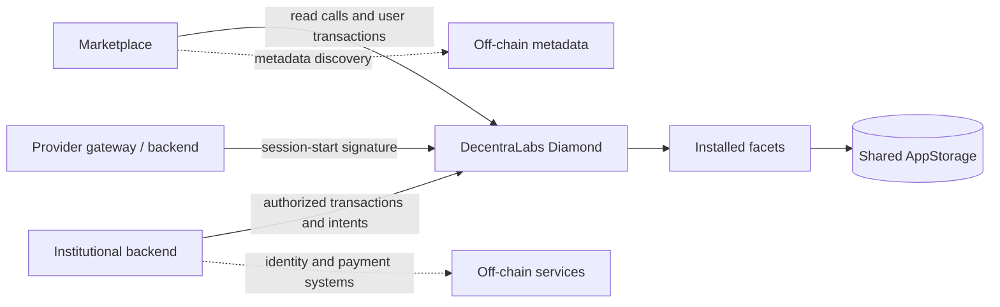

# Architecture

## Purpose and entry point

DecentraLabs exposes one EIP-2535 Diamond address per deployment. Consumers
call that address; the Diamond resolves the calldata selector, delegates to the
installed facet and keeps every protocol record in the same `AppStorage` slot.
A facet deployment is therefore an implementation detail, not an alternative
endpoint.

`contracts/Diamond.sol` contains the fallback dispatcher.
`contracts/libraries/LibDiamond.sol` owns selector routing and Diamond
ownership. `LibAppStorage.diamondStorage()` resolves the fixed storage position
used by all domain facets.

## Domain responsibilities

| Domain | On-chain responsibility | Main documentation |
| --- | --- | --- |
| Core and upgrades | Ownership, loupe inspection, selector cuts and initialization | The deployed ABI and selector manifest |
| Providers and institutions | Roles, organization registry, backend authorization and network status | [Roles and permissions](roles-and-permissions.md) |
| Labs | ERC-721 ownership, listing, immutable creator binding, metadata pointer and reputation | [Labs and metadata](labs.md) |
| Reservations | Validation, confirmation, cancellation, access state and bounded indexes | [Reservations](reservations.md) |
| Credits and settlement | Lots, treasury spending, receivables, claims and payment evidence | [Service credits and settlement](credits-and-settlement.md) |
| Intents and session evidence | EIP-712 one-time authorization and provider-signed session proof | [Intents](reference/intents.md) and [Institutional access](institutional-access.md) |

## On-chain and off-chain boundary

The Diamond is authoritative for roles, lab ownership/configuration,
reservation timestamps and status, credit balances, recorded evidence and
receivable lifecycle. It does not authenticate a user through SAML, store a
JWT, host metadata, move fiat, or open a remote session.

- **Marketplace** reads the Diamond and builds user-facing operations.
- **`blockchain-services`** validates institutional identity and reservation
  context off-chain, then submits transactions from its authorized wallet.
- **Lab Gateway** opens the provider resource only after the off-chain access
  flow; it can provide the signed inputs that become SessionStarted evidence.
- **Lab-Metadata** hosts the JSON document referenced by `LabBase.uri`.

An off-chain document or identifier may be hashed into a transaction for audit,
but it cannot override the values already stored by the Diamond.

## Upgrade boundary

Only the Diamond owner may execute `diamondCut`. A cut can add, replace or
remove selectors and may run initialization code via `delegatecall`, so it is a
privileged production operation.

1. Change a facet and its focused tests.
2. Keep `AppStorage` append-only; never reorder or remove deployed members.
3. Classify the selector in `selectors/diamond.json` and validate the public
   ABI.
4. Simulate the exact cut and use an initializer only when state needs setup.
5. Broadcast only against the intended Diamond, then record the resulting
   artifact and update consumer ABI/configuration together.

The Diamond deliberately has no `receive()` function. Bare native-asset
transfers revert rather than becoming stranded protocol funds.
