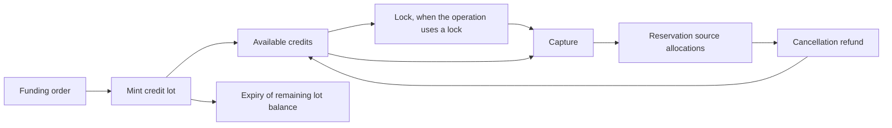
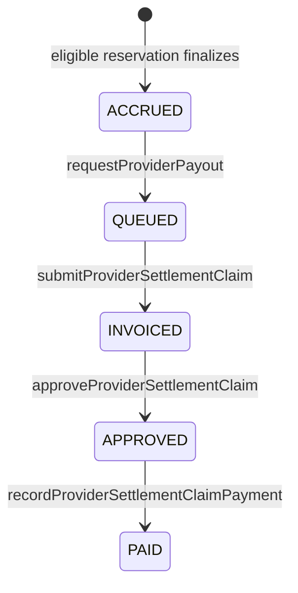

# Service credits and settlement

## Economic model

Service credits are internal accounting units. They are not native currency,
an ERC-20 token, or an externally redeemable balance held by the Diamond.
Prices, reservations and provider receivables use raw credit units.

| Constant | Value | Meaning |
| --- | ---: | --- |
| Credit decimals | `7` | Display precision for one service credit. |
| Raw units per credit | `10,000,000` | Conversion from whole credits to stored amount. |
| Accounting reference | `10` credits/EUR | Reference used for configured funding and reporting paths. |
| Default user limit | `100,000,000` raw units | Ten credits per institutional spending period. |
| Default spending period | `120 days` | Used when an institution has not configured another duration. |

Keep conversion at the integration boundary. A `LabBase.price` is a raw amount
per second, and the reservation price is the raw total for the booked duration.
The canonical scale is 7 decimals: `10,000,000` raw units equal one
credit, so one raw unit per second equals `0.00036` credits per hour. UIs and
services must use the shared conversion helpers instead of hard-coded scale
constants.

### Scale migration

The seven-decimal scale is a representation change at the raw-unit boundary.
Existing SQL credit amounts are human-readable credits and only need the
`DECIMAL(24,7)` precision migration; they must not be multiplied by 100. Existing
on-chain balances do need an explicit administrative adjustment by a factor of
100 when their old five-decimal raw value is being preserved. Existing lab prices
must be recalculated from the intended human price using nearest-integer
per-second conversion; expired reservations are not rewritten by this migration.

## Credit lifecycle and provenance

Each mint creates a `CreditLot` with a funding-order reference, EUR gross basis,
issue time, optional expiry and remaining amount. Consumption is FIFO across
available, non-expired lots. Every ledger movement records its kind, amount,
resulting available/locked balances, reference and timestamp.

| Movement | Accounting effect |
| --- | --- |
| `MINT` | Creates a traceable funding lot and available balance. |
| `LOCK` / `RELEASE` | Moves value into or out of the locked balance without consuming a lot. |
| `CAPTURE` | Consumes locked value from lots in FIFO order. |
| `CANCEL` | Refunds a previously allocated reservation amount. |
| `EXPIRE` | Removes a lot's remaining balance. |
| `ADJUST` | Records a referenced administrative correction. |

`ServiceCreditFacet` exposes the administrative ledger API and protects writes
with the default-admin role. Institutional booking uses the treasury path from
the reservation facets; clients should not substitute an arbitrary ledger call
for reservation confirmation.

## Reservation allocations and refunds

When a reservation consumes credits, the contract persists a
`CreditReservationAllocation` for every source lot. It retains the funding
order, amount, proportional EUR basis, expiry and the separately tracked refund
amounts. This lets reconciliation connect a reservation charge or refund to its
original funding provenance.

Use `getCreditReservationAllocations(account, reservationRef, offset, limit)`
for that evidence. Credit lots, movements and allocations are paginated and the
public facet caps each response at 50 records. Refunds cannot exceed the
recorded allocations and keep the original expiry context, so a cancellation
cannot create perpetual credits from an expiring lot.

## Institutional spending and cancellation

Reservation confirmation checks the payer institution's available balance and
the PUC-scoped spending allowance. The successful charge records the spending
period used by that reservation, allowing a later refund to reconcile the same
period correctly.

For an eligible consumer cancellation before the start time, the current policy
charges a total fee of 5% with a minimum of 0.1 credits (or the entire price
when it is lower). Three fifths of that fee go to the provider, equivalent to
3% of the price when the percentage fee applies; the remainder is the implicit
platform margin. A zero-price reservation creates no credit movement. A
provider-initiated pre-start cancellation instead refunds the full price and
does not accrue a provider cancellation fee.

Always call `previewInstitutionalBookingCancellation` before presenting a
confirmation screen. It returns the actual current fee, refund, spending-period
data, source expiry and allocations, rather than an off-chain estimate.

## Provider receivable and claim lifecycle

Provider revenue is a receivable, not a token payout. On successful finalization
with SessionStarted evidence, the reservation's cached provider share is added
to the lab's accrued receivable. `requestProviderPayout` processes a bounded
batch of eligible records and moves accrued value into the settlement queue.

The receivable read exposes `ACCRUED`, `QUEUED`, `INVOICED`, `APPROVED`, `PAID`,
`REVERSED` and `DISPUTED` buckets. A settlement claim has a unique non-zero
`claimId`, a lab, amount, reservation-scope hash and invoice-reference hash.
Submitting it atomically moves the claimed amount from `QUEUED` to `INVOICED`.
Approval requires an external reference. Payment requires a non-zero,
previously unused payment reference plus an attestation hash, then moves the
claim from `APPROVED` to `PAID`.

Use `getLabProviderReceivableLifecycle` for aggregate amounts and
`getProviderSettlementClaim` for the audit record. Claim and financial
transitions are restricted to the current provider/authorized backend, a
configured settlement operator, or the default admin as defined by the facet.
