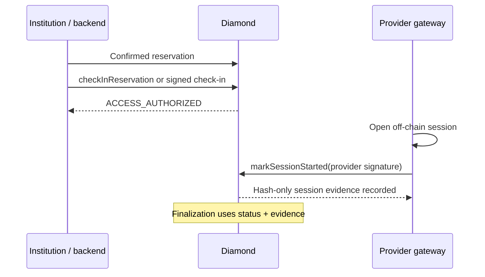

# Institutional access and session evidence

## Two separate facts

The contract deliberately separates authorization to access a lab from proof
that a remote session started. `ACCESS_AUTHORIZED` is not enough to earn a
provider receivable.

JWTs, SAML assertions, passwords and raw session IDs stay off-chain. The
contract stores only the protocol fields and hashes needed to verify and audit
the evidence.

## Check-in: authorization

`ReservationCheckInFacet` moves a reservation from `CONFIRMED` to
`ACCESS_AUTHORIZED` only inside its reservation window. The default admin can
make the direct call. The signature path accepts an EIP-712 check-in signed by:

- the renter for a non-institutional record; or
- the payer institution or its authorized backend for an institutional record.

The signature binds signer, reservation key, PUC hash, chain ID and Diamond
address. Its timestamp must not be in the future or more than five minutes old.
The gateway still performs the technical access flow independently.

### Trust boundary and WebAuthn

WebAuthn is an off-chain institutional-backend control. The Diamond does not
parse or verify a WebAuthn assertion. The intent path verifies the caller,
executor, action, payload hash, registered intent, nonce and expiry; the
backend verifies SAML and WebAuthn before it reaches that path. Consequently,
WebAuthn protects the user only while the institutional backend and its signing
wallet are acting as honest authorities. It is not a cryptographic control
against compromise of that backend or wallet.

The reservation selectors must not be conflated:

| Selector | Current role | WebAuthn/intent property |
| --- | --- | --- |
| `institutionalDirectBookingWithIntent` | Active `DIRECT_BOOKING` path for an institution-owned lab; atomically requests and confirms | Requires a pending action-11 intent; WebAuthn remains an off-chain backend gate |
| `institutionalReservationRequestWithIntent` | Active `REQUEST_BOOKING` path for an external lab | Requires a pending action-8 intent; WebAuthn remains an off-chain backend gate |
| `institutionalReservationRequest` | Direct institution/backend request selector retained in the Diamond allowlist | Requires only institution/backend caller authorization; no intent or WebAuthn |

The current Marketplace and canonical `Lab Gateway/blockchain-services` code
call the two `*WithIntent` selectors. A repository-wide audit found no active
caller for `institutionalReservationRequest`; because the selector remains in
the current Diamond selector allowlist and ABI and may have external callers,
it must be treated as an available administrative surface until explicitly
removed through a reviewed Diamond upgrade and ABI/deployment migration.

The Marketplace registers the intent and creates the backend authorization
session before the user completes WebAuthn. That ordering is intentional for
latency and does not make the intent a proof of WebAuthn. If the backend or its
wallet is compromised, it can use its institution/backend authority, including
the direct selector above, without a user's WebAuthn assertion. The current
threat model therefore treats that backend and wallet as the institution's
trusted authority and relies on key custody, least privilege, audit and
segregation of duties. A stronger threat model would require a separate
attestor or second authorization signature, restrict/remove the direct
selector, and turn the admin check-in path into an explicitly governed
emergency operation.

`checkInReservation` is likewise an administrative override: it requires only
`DEFAULT_ADMIN_ROLE`, has no institutional signature input and is not the
normal consumer check-in route. Operators must keep that role separate from
institutional wallets and record its use. The current contract does not add a
timelock or a dedicated emergency event; those are hardening options if admin
compromise is in scope.

## SessionStarted: proof

`ReservationSessionFacet.markSessionStarted` accepts provider-signed EIP-712
evidence only after access has been authorized. The input binds the reservation
key, string form of the lab ID, PUC hash, gateway/session/access-type hashes,
start time, nonce, credential hash and client-proof hash.

The contract verifies all of the following:

- the reservation is `ACCESS_AUTHORIZED` and `startedAt` is inside its window;
- the signer is the current ERC-721 lab owner;
- PUC and lab ID match the reservation;
- the attestation is not future-dated and is submitted no later than the
  reservation's `end + 1 day` session-attestation deadline;
- the reservation, nonce and gateway/session/access-type observation have not
  already been used.

Only hash values are persisted. Reusing a credential, nonce or observed session
across reservations is rejected by the corresponding uniqueness guard.

## Economic consequence

After the reservation ends, permissionless finalization waits through the
session-attestation deadline. An access-authorized reservation with valid
SessionStarted evidence can accrue provider revenue and contributes to
completion reputation. If that evidence never arrives, finalization refunds the
priced reservation instead of treating access authorization as proof of service.
