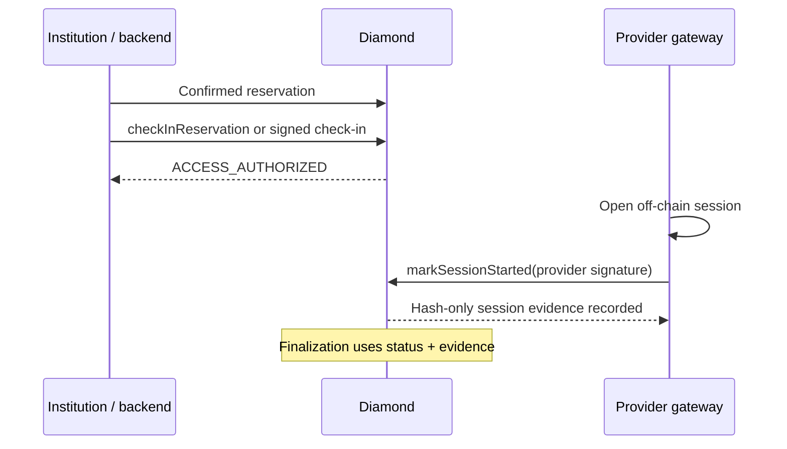

# Institutional access and session evidence

## Two separate facts

The contract deliberately separates authorization to access a lab from proof
that a remote session started. `ACCESS_AUTHORIZED` is not enough to earn a
provider receivable.

JWTs, SAML assertions, passwords and raw session IDs stay off-chain. The
contract stores only the protocol fields and hashes needed to verify and audit
the evidence.

## Check-in: authorization

`ReservationCheckInFacet` moves a reservation from `CONFIRMED` to
`ACCESS_AUTHORIZED` only inside its reservation window. The default admin can
make the direct call. The signature path accepts an EIP-712 check-in signed by:

- the renter for a non-institutional record; or
- the payer institution or its authorized backend for an institutional record.

The signature binds signer, reservation key, PUC hash, chain ID and Diamond
address. Its timestamp must not be in the future or more than five minutes old.
The gateway still performs the technical access flow independently.

## SessionStarted: proof

`ReservationSessionFacet.markSessionStarted` accepts provider-signed EIP-712
evidence only after access has been authorized. The input binds the reservation
key, string form of the lab ID, PUC hash, gateway/session/access-type hashes,
start time, nonce, credential hash and client-proof hash.

The contract verifies all of the following:

- the reservation is `ACCESS_AUTHORIZED` and `startedAt` is inside its window;
- the signer is the current ERC-721 lab owner;
- PUC and lab ID match the reservation;
- the attestation is not future-dated or older than the configured one-day
  grace window;
- the reservation, nonce and gateway/session/access-type observation have not
  already been used.

Only hash values are persisted. Reusing a credential, nonce or observed session
across reservations is rejected by the corresponding uniqueness guard.

## Economic consequence

After the reservation ends, permissionless finalization waits through the
session-attestation deadline. An access-authorized reservation with valid
SessionStarted evidence can accrue provider revenue and contributes to
completion reputation. If that evidence never arrives, finalization refunds the
priced reservation instead of treating access authorization as proof of service.
