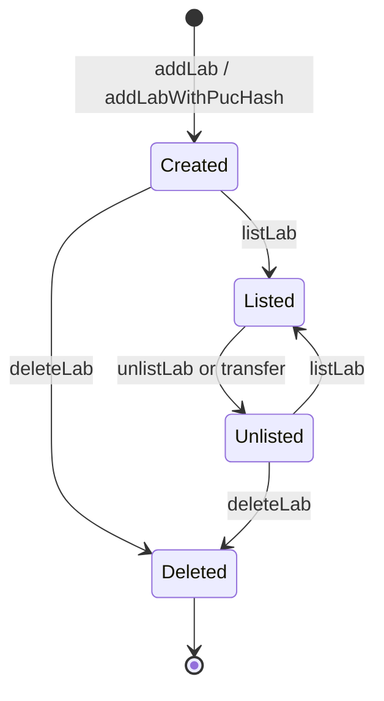

# Labs and metadata

## On-chain lab record

Every laboratory is an ERC-721 token. Its token ID is the stable identifier
used by reservations, access authorization, reputation and settlement.

| `LabBase` field | Protocol meaning |
| --- | --- |
| `uri` | URI of the off-chain lab metadata JSON. |
| `price` | Raw service-credit price per second, using `10,000,000` raw units per credit. |
| `accessURI` | Provider routing or service endpoint identifier. |
| `accessKey` | Public routing identifier; never a password or bearer token. |
| `createdAt` | On-chain registration time. |
| `resourceType` | `0` is exclusive physical/remote capacity; `1` is concurrent FMU capacity. |

The metadata document is descriptive. Changing JSON at `uri` cannot change the
stored price, resource type, owner or reservation state. Validate its schema
and availability off-chain before publishing a lab.

## Lifecycle

`addAndListLab` combines creation and listing. The corresponding
`*WithPucHash` functions atomically bind a non-zero creator PUC hash. For a
legacy unbound lab, its current token owner can call `bindLabCreatorPucHash`
once; the binding cannot later be replaced. `getPucHash` deliberately remains
available after a burn so off-chain deletion cleanup can authenticate the
record.

Intent-based creation also requires a non-zero PUC hash. Subsequent
`*WithIntent` lab changes check that hash in addition to consuming the signed
intent. Direct owner calls use ERC-721 ownership checks; integrators that need
creator-identity binding should select the PUC-aware or intent path.

## Listing, changes and deletion

`listLab` makes a lab eligible for new reservations and clears its
stop-intake flag. `unlistLab` removes it from new intake while preserving
existing reservation obligations. The legacy `listToken` and `unlistToken`
selectors are intentionally forbidden from the production surface.

The owner may update URI, price and access identifiers. Changing
`resourceType` is blocked while active bookings exist. Deletion is blocked
while the lab has active reservations or an unsettled receivable position; it
unlists the lab, stops intake, burns the token and removes it from the active
catalog only once those obligations are clear.

An ERC-721 transfer unlists the lab. Pending reservations prevent transfer;
confirmed and access-authorized records migrate their provider association to
the recipient within the transfer safeguards. Treat a transfer as an
operational handover, not as a way to erase active obligations.

## Capacity model

| Resource type | On-chain scheduling | Operational responsibility |
| --- | --- | --- |
| `0` | Inserts confirmed ranges into the interval calendar and rejects overlaps. | One exclusive physical or remote resource per booked range. |
| `1` | Does not apply the exclusive calendar conflict rule in the same way. | FMU/runtime capacity and concurrency remain provider-side policy. |

The numeric on-chain value is authoritative. Metadata can describe capacity,
but cannot turn an exclusive lab into a concurrent resource.

## Reputation

`LabReputationFacet` exposes score, rating and event counters. A completed
access-authorized reservation records a completion only when the required
SessionStarted evidence exists. Provider-initiated cancellation records a
separate cancellation event. Operators may use the read values for discovery,
but they are not an authorization mechanism.
