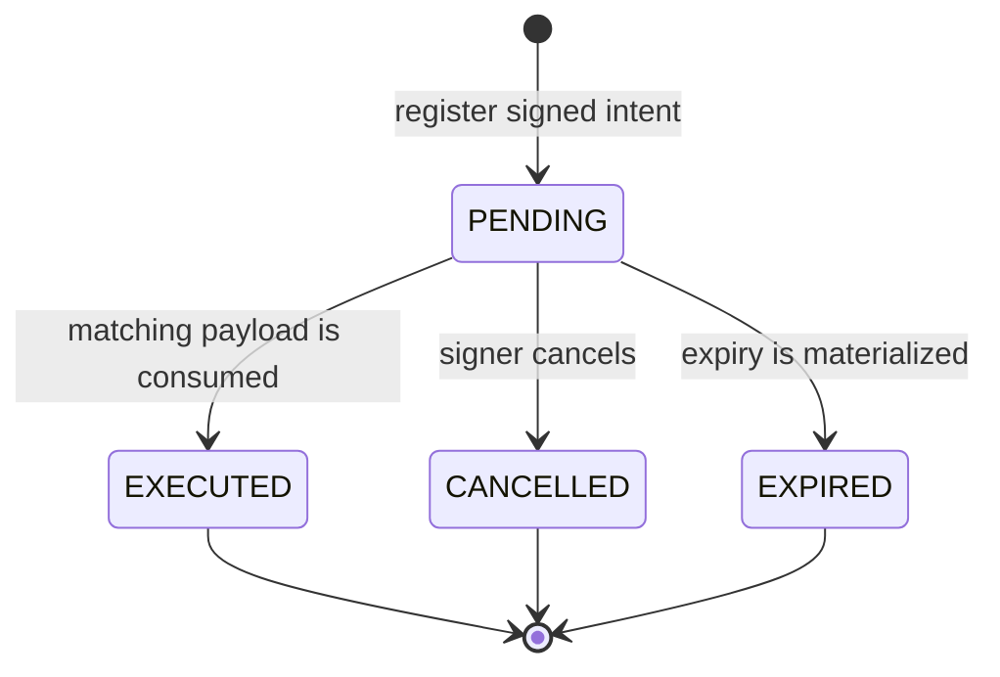

# Intent registry

## Purpose

An intent is a signed, one-time authorization for an exact payload and
executor. It is not a reservation and does not itself move credits. The
reservation or lab facet consumes the matching intent as part of the state
change it authorizes.

The numeric lifecycle values are contractual and must be consumed exactly as
defined by the Solidity enum:

| Value | State |
| ---: | --- |
| `0` | `None` |
| `1` | `Pending` |
| `2` | `Executed` |
| `3` | `Cancelled` |
| `4` | `Expired` |

## Registration and signature binding

`IntentRegistryFacet` accepts registration only from the default admin and
requires `meta.signer == msg.sender`. The supplied EIP-712 signature is checked
against the signer (including ERC-1271 contract-signature support). This is a
deliberate administrative registration boundary; consuming a registered intent
is then governed by the relevant institution/provider flow.

The EIP-712 domain binds the intent to the chain ID and Diamond address. Intent
metadata binds all of the following:

- globally unique `requestId`;
- signer and required executor;
- action code and canonical payload hash;
- signer-scoped sequential nonce;
- requested timestamp and expiry.

At consumption, `*WithIntent` functions require the caller to equal the payload
executor, recompute the payload hash, check the expected action and mark the
intent as executed. A replay, action change, executor change or payload change
reverts.

## Action codes

| Code | Action |
| ---: | --- |
| `1`–`7` | Add, add-and-list, set URI, update, delete, list and unlist a lab. |
| `8` | Request an institutional booking. |
| `9` | Cancel an institutional reservation request. |
| `10` | Cancel a confirmed institutional booking. |
| `11` | Create and confirm an own-lab institutional direct booking. |

Reservation payloads bind organization text, PUC hash, optional assertion hash,
lab, range, expected total price and reservation key. The contract resolves the
organization to its registered institution and authorizes that institution or
its backend as executor; the backend is never substituted for the payer.
Action `11` is implemented by `institutionalDirectBookingWithIntent`.
WebAuthn is verified by the institutional backend before intent execution; it
is not verified by `LibIntent` or by the Diamond. The former direct
institution/backend reservation selector is not part of the production
surface.
Action payloads bind the
same identity context plus the lab administration or cancellation fields. The
reservation intent facet independently recalculates the reservation key and
price from live lab state before acting.

## Expiry, cancellation and integration

The signer can cancel only a pending intent. Anyone can call `expireIntent`
after its deadline to persist the `EXPIRED` state. `getIntent` reports a
pending intent as expired after its deadline even before that write occurs.
Neither operation cancels a reservation that has already been created.

Persist the request ID and nonce with the off-chain business operation. On a
delivery failure, inspect the transaction receipt and intent state before
retrying; resend the same signed payload rather than generating a second intent
for the same operation. Keep raw signatures and private keys out of metadata
and logs.
