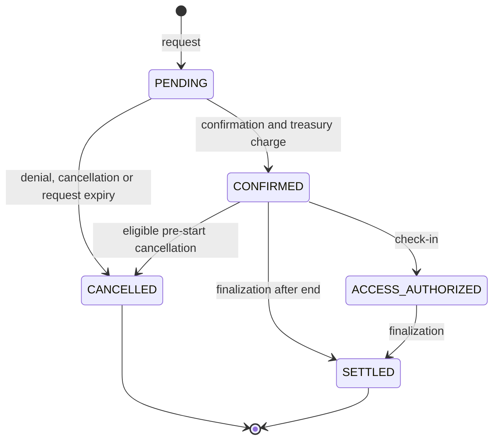

# Reservations

## Scope and identifiers

The production Diamond exposes institutional reservation write paths. The
older generic request, confirmation and cancellation selectors are explicitly
forbidden by `selectors/diamond.json`; consumers should not build new flows on
them.

A reservation stores lab, renter/tracking identity, payer and collector
institutions, price, provider share, timestamps and lifecycle status. For
institutional paths the reservation key is derived from `labId` and `start`;
the PUC hash is stored separately and a derived tracking key indexes the
institutional user without exposing the raw identifier.

## Lifecycle

| Value | Status | Meaning |
| ---: | --- | --- |
| `0` | `PENDING` | Request exists; it does not occupy the active calendar. |
| `1` | `CONFIRMED` | Booking has passed provider and treasury checks and is active. |
| `2` | `ACCESS_AUTHORIZED` | On-chain access was authorized; this is not proof of a started session. |
| `3` | `SETTLED` | Finalization cleaned active indexes and applied the economic outcome. |
| `4` | `CANCELLED` | Request or booking was cancelled and cleaned from active indexes. |

## Request and confirmation

An institution wallet or its authorized backend creates a request with a
non-zero PUC hash, an existing lab and a valid time range. The intent-bound
organization must resolve on-chain to that institution; the backend is only
the transaction executor and is never stored as the payer. Validation enforces
the request TTL (currently five minutes), the lab's booking rules and the
institutional user's policy. A pending request can be denied by the eligible
provider side, cancelled through the institutional path, or released after its
TTL.

External-request confirmation may be submitted only by the current lab owner or
its authorized backend. It checks the PUC binding, provider network status,
listing and stop-intake state. For a priced booking it spends the payer
institution's treasury and captures the current spending-period context; a
failed treasury spend cancels the request. A same-institution own-lab intent
can atomically request and confirm through the direct-booking path. The current
lab owner or its authorized backend may execute that path, while the owner
remains the payer/provider identity. It is a separate payer-authorized flow
implemented by `institutionalDirectBookingWithIntent`, not by
`institutionalReservationRequest`.

The separate `institutionalReservationRequest` selector is a direct
institution/backend request path retained in the Diamond selector allowlist. It is not
called by the current Marketplace or canonical backend flow, does not consume
an intent and does not verify WebAuthn. Treat it as an institution/backend
trust-boundary surface until a reviewed Diamond upgrade removes it.

Confirmation inserts an exclusive (`resourceType = 0`) range into the interval
calendar, queues the reservation for later settlement, and stores the provider
share. A concurrent FMU resource (`resourceType = 1`) uses the same lifecycle
without the exclusive-calendar conflict path, but counts active overlapping
reservations against the lab's on-chain `maxConcurrentReservations` before the
treasury call. The count and confirmation are one atomic contract transition;
the read-only occupancy query is not an authorization primitive.

## Finalization and queries

`releaseInstitutionalExpiredReservations` is permissionless and bounded by a
maximum batch of 50 records. It finalizes:

- confirmed reservations after their end; and
- access-authorized reservations after their end when SessionStarted evidence
  exists, or after the session-attestation deadline otherwise.

Finalization removes calendar, lab, renter and institutional-user indexes as
one operation. When valid session evidence is present, it accrues the provider
share. For a physical lab without it, the no-show settlement refunds 75%,
accrues 15% to the provider and retains 10% as the implicit platform margin.
A simulation without evidence is refunded in full.

The same economic deadline is also enforced by the bounded cleanup performed
while validating a new request for a user near the per-lab reservation cap. That
cleanup cannot settle an `ACCESS_AUTHORIZED` reservation without
`SessionStarted` evidence until `end + 1 day`; a delayed attestation therefore
cannot be invalidated by requesting another reservation. Permissionless release,
cap cleanup and provider payout all delegate their terminal transition to the
same `LibInstitutionalReservationSettlement` path.

Use `getReservation`, availability reads and the paginated institutional/query
functions for state inspection. Do not infer availability from a pending request
or from off-chain calendar data.

## Cancellation and denial

The normal institutional cancellation path is limited to a confirmed booking
before its start time and requires the configured backend plus the matching PUC
hash. Physical labs charge 10% (with the configured minimum); simulations
refund 100%. A provider-side cancellation is separate: the current provider
or its authorized backend must provide a non-zero reason code; the payer
receives the full price and provider reputation is adjusted. At least 24 hours'
notice is scored -1, less than 24 hours' notice is scored -2, and the explicit
`PROVIDER_SERVICE_FAILURE` reason is scored -3. The latter is permitted for a
confirmed or access-authorized reservation only while the attestation grace
period is open and only when `SessionStarted` has not been recorded. Therefore
an ordinary payer no-show is not itself treated as provider misconduct.

For a pending external request, only the current ERC-721 lab owner or the
backend currently authorized by that owner may deny. The payer institution and
its backend may cancel their own pending request, but they cannot deny it or
turn it into a confirmed external booking. Own-lab `DIRECT_BOOKING` is the
explicit atomic exception because the payer and provider are the same
institution.

`previewInstitutionalBookingCancellation` returns the contract's current
calculation before a transaction: status, eligibility, refund destination,
fees, cutoff, period data, source-credit expiry, allocations and policy
version. Use this read for confirmation UI rather than duplicating fee logic.
