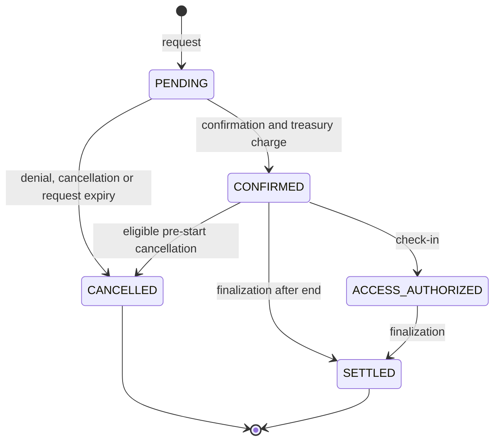

# Reservations

## Scope and identifiers

The production Diamond exposes institutional reservation write paths. The
older generic request, confirmation and cancellation selectors are explicitly
forbidden by `selectors/diamond.json`; consumers should not build new flows on
them.

A reservation stores lab, renter/tracking identity, payer and collector
institutions, price, provider share, timestamps and lifecycle status. For
institutional paths the reservation key is derived from `labId` and `start`;
the PUC hash is stored separately and a derived tracking key indexes the
institutional user without exposing the raw identifier.

## Lifecycle

| Value | Status | Meaning |
| ---: | --- | --- |
| `0` | `PENDING` | Request exists; it does not occupy the active calendar. |
| `1` | `CONFIRMED` | Booking has passed provider and treasury checks and is active. |
| `2` | `ACCESS_AUTHORIZED` | On-chain access was authorized; this is not proof of a started session. |
| `3` | `SETTLED` | Finalization cleaned active indexes and applied the economic outcome. |
| `4` | `CANCELLED` | Request or booking was cancelled and cleaned from active indexes. |

## Request and confirmation

An institution wallet or its authorized backend creates a request with a
non-zero PUC hash, an existing lab and a valid time range. Validation enforces
the request TTL (currently five minutes), the lab's booking rules and the
institutional user's policy. A pending request can be denied by the eligible
provider side, cancelled through the institutional path, or released after its
TTL.

Confirmation may be submitted by the payer institution/backend or the current
lab owner/backend. It checks the PUC binding, provider network status, listing
and stop-intake state. For a priced booking it spends the institutional treasury
and captures the current spending-period context; a failed treasury spend
cancels the request. A same-institution own-lab intent can atomically request
and confirm through the direct-booking path.

Confirmation inserts an exclusive (`resourceType = 0`) range into the interval
calendar, queues the reservation for later settlement, and stores the provider
share. A concurrent FMU resource (`resourceType = 1`) uses the same lifecycle
without the exclusive-calendar conflict path.

## Finalization and queries

`releaseInstitutionalExpiredReservations` is permissionless and bounded by a
maximum batch of 50 records. It finalizes:

- confirmed reservations after their end; and
- access-authorized reservations after their end when SessionStarted evidence
  exists, or after the session-attestation deadline otherwise.

Finalization removes calendar, lab, renter and institutional-user indexes as
one operation. When valid session evidence is present, it accrues the provider
share. Without it, the priced reservation is refunded through the institutional
treasury path instead.

Use `getReservation`, availability reads and the paginated institutional/query
functions for state inspection. Do not infer availability from a pending request
or from off-chain calendar data.

## Cancellation and denial

The normal institutional cancellation path is limited to a confirmed booking
before its start time and requires the configured backend plus the matching PUC
hash. It applies the configured cancellation accounting. A provider-side
cancellation is separate: the current provider or its authorized backend must
provide a non-zero reason code; the payer receives the full price and provider
reputation is adjusted.

`previewInstitutionalBookingCancellation` returns the contract's current
calculation before a transaction: status, eligibility, refund destination,
fees, cutoff, period data, source-credit expiry, allocations and policy
version. Use this read for confirmation UI rather than duplicating fee logic.
